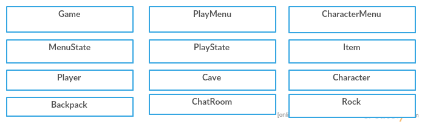
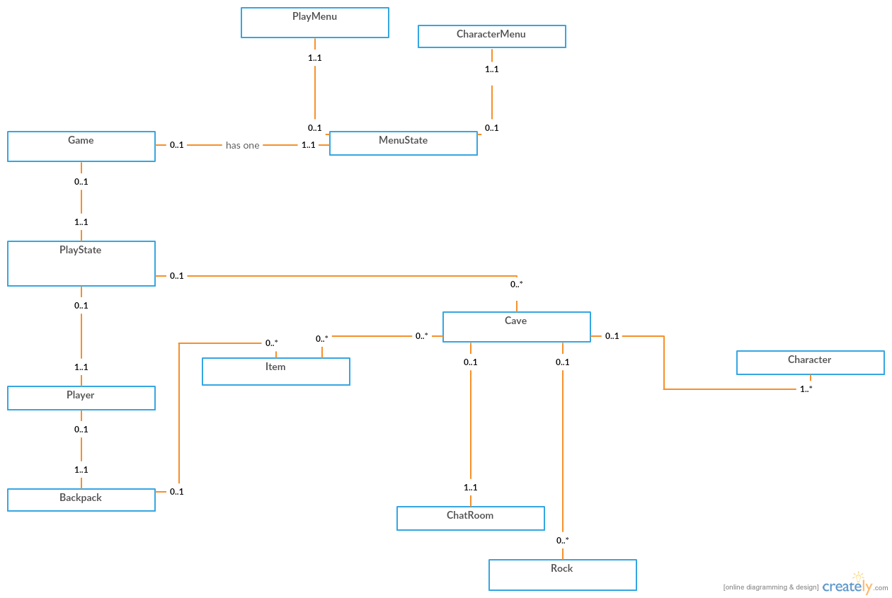

# Domain Model

Assignment in the course PA1415 Programvarudesign
2017-04-19  

### Authors And Author Contribution

| Author Name	          | Social security number	| Thinking	 | Writing	|
| -------------         |------------------------	| ---------- |--------- |
|Markus Hederström      | 930712-0916 		        |   25% 	   |	     25%|
|Kristoffer Danbrandt   | 880429-7490      		    |   25% 	   |		   25%|
|Dag Wirström           | 931022-8177      		    |   25% 	   |		   25%|
|Tommy Segerström       | 970401-5354      		    |   25% 	   |		   25%|

## System Description
Nethack is an old game where you walk in a dungeon and explore. Each level has a different landscape which is generated randomly. The objective of the system we are going to develop is to make a similar game where the map is generated by Twitter feeds. The system shall also follow a list of requirements.

## Initial Domain Model

  

## Guidelines Applied

| Conceptual Class Category | Identified Concept                                        |
| :------------------------ | :-------------------------------------------------------- |
| States                    | PlayState, MenuState, CharacterMenu, PlayMenu, ChatRoom   |
| Game Objects              | Item, Rock, Character, Cave, Backpack                     |
| Application               | Game                                                      |
| Player                    | Player                                                    |

## Completed Domain Model

  
