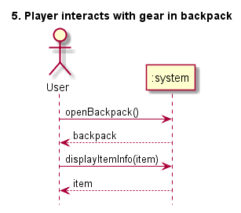
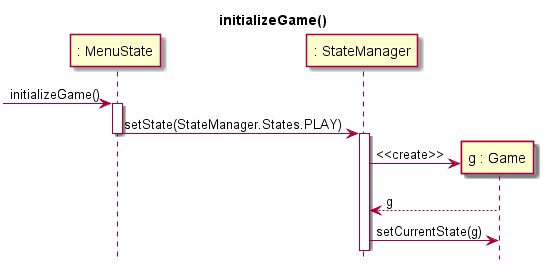
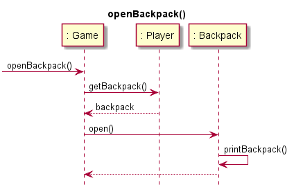
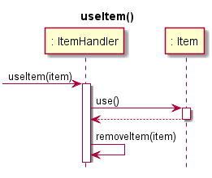
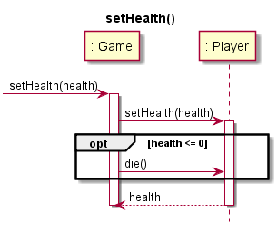
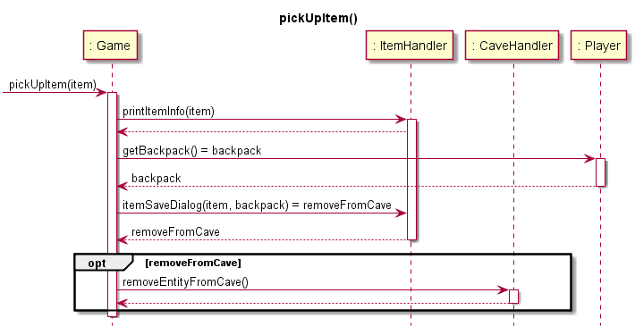
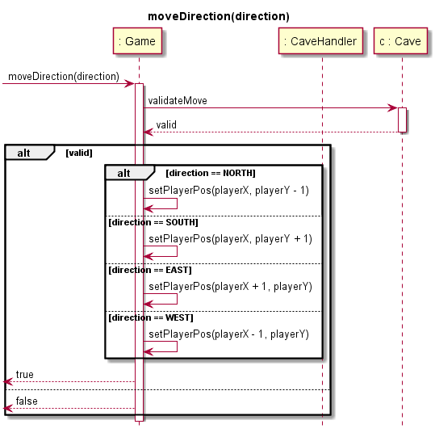

# Interaction Diagrams for System TwitterNethack

Assignment in the course PA1415 Programvarudesign  
2017-04-25  

### Authors And Author Contribution

| Author Name	          | Social security number	| Thinking	 | Writing	|
| -------------         |------------------------	| ---------- |--------- |
|Markus Hederström      | 930712-0916 		        |   25% 	   |	     25%|
|Kristoffer Danbrandt   | 880429-7490      		    |   25% 	   |		   25%|
|Dag Wirström           | 931022-8177      		    |   25% 	   |		   25%|
|Tommy Segerström       | 970401-5354      		    |   25% 	   |		   25%|

## System Description
Nethack is an old game where you walk in a dungeon and explore. Each level has a different landscape which is generated randomly. The objective of the system we are going to develop is to make a similar game where the map is generated by Twitter feeds. The system shall also follow a list of requirements.

## Prioritized List of Use Cases
##### Motivation for priorities:

|ID	          | Use Case Name	                                          | Priority  |
| ------------|---------------------------------------------------------| --------- |
|     1       |    #1 - Player starts a new game                        |    100    |
|     16      |    #16 - Enter new cave                                 |    100    |
|     21      |    #21 - Character movement                             |    100    |
|     5       |    #5 - Player interacts with gear in his backpack      |    95     |
|     15      |    #15 - Item interaction                               |    95     |
|     4       |    #4 - Player interacts with new item                  |    90     |
|     17      |    #17 - Scan page for other timelines                  |    85     |
|     2       |    #2 - Player joins an existing game                   |    85     |
|     10      |    #10 - Enter chat room                                |    80     |
|     9       |    #9 - Send chat message                               |    80     |
|     6       |    #6 - Interact with character                         |    70     |
|     8       |    #8 - Use default item action                         |    70     |
|     11      |    #11 - Leave chat room                                |    70     |
|     7       |    #7 - Drop an item                                    |    65     |
|     3       |    #3 - User sets up his player                         |    60     |
|     12      |    #12 - Use item on another player                     |    55     |
|     13      |    #13 - Give item from backpack to another player.     |    55     |
|     14      |    #14 - Use items default action on pickup             |    50     |
|     18      |    #18 - Falling rocks                                  |    45     |
|     20      |    #20 - Player dies                                    |    45     |
|     19      |    #19 - Falling rocks hit armor                        |    35     |

## System Events
### System Events for Use Case “#1 Start the Game”:

#### Captured system events:

* initializeGame()

### System Events for Use Case “#15 Item interaction”:

#### Captured system events:

* openBackpack()
* useItem()

### System Events for Use Case “#20 Player dies”:

#### Captured system events:

* setHealth(0)
* endGameSession()

### System Events for Use Case “#4 Player interacts with new item”:

#### Captured system events:

* pickUpItem(item)

### System Events for Use Case “#5 Player interacts with gear in his backpack”:

#### Captured system events:
* openBackpack()
* displayItemInfo(item)

### System Events for Use Case “#16 Enter new cave”:

#### Captured system events:
* enterCave(cave)

### System Events for Use Case “#21 Character movement”:

#### Captured system events:
* moveDirection(direction)

### System Events for Use Case “#6 Interact with character”:

#### Captured system events:
* interactWithCharacter(character)

## Interaction Diagrams

### Use Case: “Start the Game”
**initializeGame()**  

### Use Case “#15 Item interaction”:
**openBackpack()**  

**useItem()**  

### Use Case “#20 Player dies”:

**setHealth(0)**  

**endGameSession()**  

### Use Case “#4 Player interacts with new item”:

**pickUpItem(item)**  

### Use Case “#5 Player interacts with gear in his backpack”:

**openBackpack()**  

**displayItemInfo(item)**  

### Use Case “#16 Enter new cave”:

**enterCave(cave)**  

### Use Case “#21 Character movement”:

**moveDirection(direction)**  

### Use Case “#6 Interact with character”

**interactWithCharacter(character)**  

