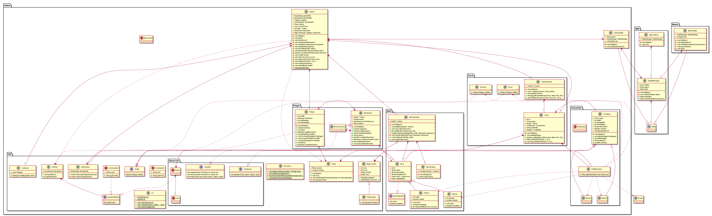

# Package Diagram for System TwitterNethack

Assignment in the course PA1415 Programvarudesign  
2017-04-27  

| Author Name	          | Social security number	| Thinking	 | Writing	|
|-----------------------|-------------------------|------------|----------|
|Markus Hederström      | 930712-0916 		        |   25% 	   |	     25%|
|Kristoffer Danbrandt   | 880429-7490      		    |   25% 	   |		   25%|
|Dag Wirström           | 931022-8177      		    |   25% 	   |		   25%|
|Tommy Segerström       | 970401-5354      		    |   25% 	   |		   25%|

## System Description
Nethack is an old game where you walk in a dungeon and explore. Each level has a different landscape which is generated randomly. The objective of the system we are going to develop is to make a similar game where the map is generated by Twitter feeds. The system shall also follow a list of requirements.  

## Overall Packages

| Package | Brief Description	                                                                |
| --------|---------------------------------------------------------------------------------- |
|App      | Main application. Contains classes associated with the main app. 		              |
|Menu     | Classes concerning the menu.      		                                            |
|Game     | Game classes. Contains packages associated with the game and the main game class. |
|Item     | Item classes and handlers.      		                                              |
|Player   | Contains the player class and classes that are related with the player.           |
|Util     | Util classes and helpers.                                                         |
|Character| Package container for the character classes.                                      |
|Cave     | Contains classes associated to cave class.                                        |

## Package Diagram

