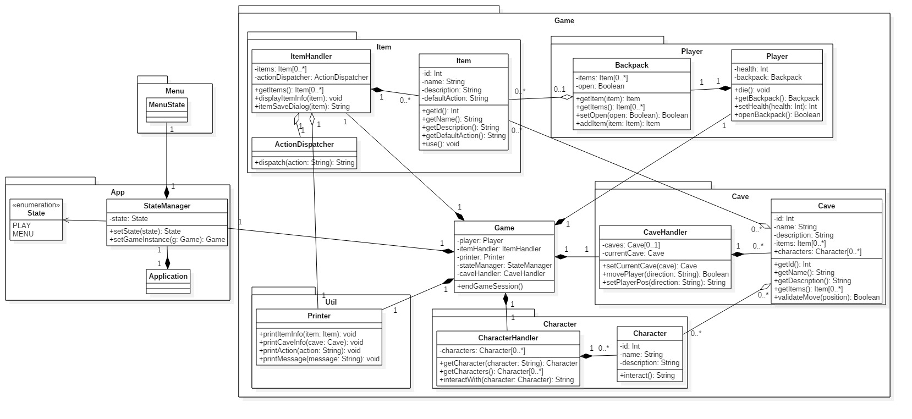

# Package Diagram for System TwitterNethack

Assignment in the course PA1415 Programvarudesign  
2017-04-24  

| Author Name	          | Social security number	| Thinking	 | Writing	|
| -------------         |------------------------	| ---------- |--------- |
|Markus Hederström      | 930712-0916 		        |   25% 	   |	     25%|
|Kristoffer Danbrandt   | 880429-7490      		    |   25% 	   |		   25%|
|Dag Wirström           | 931022-8177      		    |   25% 	   |		   25%|
|Tommy Segerström       | 970401-5354      		    |   25% 	   |		   25%|

## System Description
Nethack is an old game where you walk in a dungeon and explore. Each level has a different landscape which is generated randomly. The objective of the system we are going to develop is to make a similar game where the map is generated by Twitter feeds. The system shall also follow a list of requirements.  

## Overall Packages

| Package               | Brief Description	                                                                |
| -------------         |---------------------------------------------------------------------------------	|
|Presentation Layer     | User Interface. Contains the views that is displayed to the screen 		            |
|Business Logic Layer   | Core functionality. Contains services that uses the Repository layer.      		    |
|Storage                | Storage of state and session      		                                            |
|Data Access Layer      | Data access objects. Handles typical CRUD operations. Repositories      		      |
|External Services      | External services that are used in the application                                |
|Database               | Database handlers, JDBC etc                                                       |
|Entities               | Data Access Objects                                                               |
|Repositories           | The repositories handle the actual fetching of the data needed.                   |
|Services               | Handle information exchange between Data Access Layer and user interface.         |

## Package Diagram

