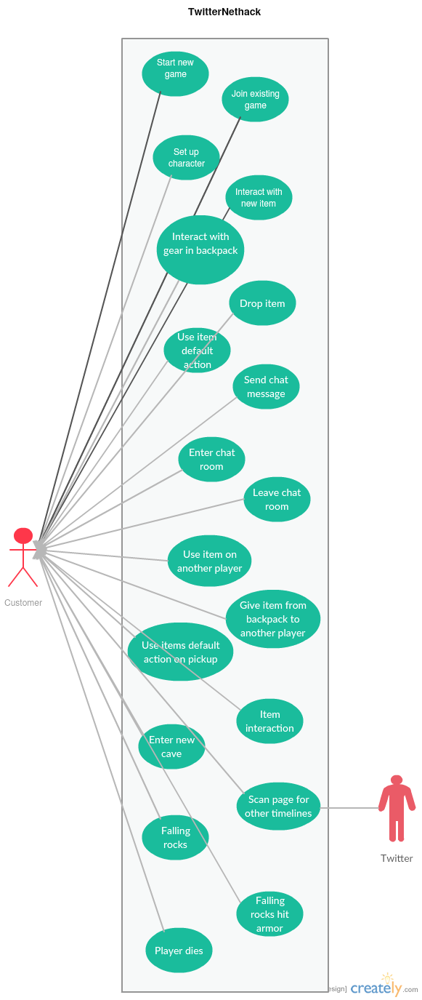

# List of Use Cases for System TwitterNethack
Assignment in the course PA1415 Programvarudesign  
2017-04-06  

| Author Name	          | Social security number	| Thinking	 | Writing	|
| -------------         |------------------------	| ---------- |--------- |
|Markus Hederström      | 930712-0916 		        |   25% 	   |	     25%|
|Kristoffer Danbrandt   | 880429-7490      		    |   25% 	   |		   25%|
|Dag Wirström           | 931022-8177      		    |   25% 	   |		   25%|
|Tommy Segerström       | 970401-5354      		    |   25% 	   |		   25%|

## System Description
Nethack is an old game where you walk in a dungeon and explore. Each level has a different landscape which is generated randomly. The objective of the system we are going to develop is to make a similar game where the map is generated by Twitter feeds. The system shall also follow a list of requirements.

## Description of Actors
**Player:** The player who is playing the game  
**System:** The operating system as in the game itself  

## Use Cases

#### Use Case #1
**Use Case:** Player starts a new game  
**Actors:** Player  
**Description:** The player starts the game and sees an opening screen with two options: Start a new game or join an existing game. The player selects “new game”  
**Preconditions:** Player must have the game  
**Concerned user stories:** 1  
**Main Course of Events:**  

| Actor                                                   | System                                                    |
| :------------------------------------------------------ | :-------------------------------------------------------- |
| 1. Players starts the game                              |                                                           |
|                                                         | 2. System displays an opening screen with a menu          |
| 3. Player selects the item “New game” on the menu       |                                                           |
|                                                         | 4. System starts a new game                               |

## Use Case #2
**Use Case:** Player joins an existing game  
**Actors:** Player  
**Description:** The player starts the game and sees an opening screen with two options: Start a new game or join an existing game. The player selects “Join an existing game”.  
**Preconditions:** There must be an existing game  
**Concerned user stories:** 2  
**Main Course of Events:**  

| Actor                                                               | System                                                             |
| :------------------------------------------------------------------ | :----------------------------------------------------------------- |
| 1. Players starts the game                                          |                                                                    |
|                                                                     | 2. System displays an opening screen with a menu                   |
| 3. Player selects the item “Join an existing game” from the menu    |                                                                    |
|                                                                     | 4. System display a list of existing games that the user may join  |
| 5. Player selects a game from the lists and joins the game          |                                                                    |

## Use Case #3
**Use Case:** User sets up his player  
**Actors:** Player  
**Description:** The player starts the game and selects “Setup player” from the menu.  
**Preconditions:**  Player must have started the game  
**Concerned user stories:** 20  
**Main Course of Events:**  

| Actor                                                               | System                                                             |
| :------------------------------------------------------------------ | :----------------------------------------------------------------- |
| 1. Players starts the game                                          |                                                                    |
|                                                                     | 2. System displays an opening screen with a menu                   |
| 3. Player selects “Setup player” from the menu                      |                                                                    |
|                                                                     | 4. System displays input values for creating a player              |

## Use Case #4
**Use Case:** Player interacts with new item  
**Actors:** Player  
**Description:** Player finds item in labyrinth  
**Preconditions:** 1. Player must be in a cave. 2. There must be an item in the cave  
**Concerned user stories:** 3  
**Main Course of Events:**  

| Actor                                                               | System                                                             |
| :------------------------------------------------------------------ | :----------------------------------------------------------------- |
|                                                                     | 1. System informs about found item                                 |
| 2. Player press key to interact with item                           |                                                                    |
|                                                                     | 3. System display information about item                           |
| 4. Player saves item or lets it stay on the ground.                 |                                                                    |
|                                                                     | 5. System saves data about items state                             |

## Use Case #5
**Use Case:** Player interacts with gear in his backpack.  
**Actors:** Player, System  
**Description:** Player gets information about gear and items.  
**Preconditions:** There must be an item in the backpack that is interactable  
**Concerned user stories:** 3, 4  
**Main Course of Events:**  

| Actor                                                               | System                                                   |
| :------------------------------------------------------------------ | :--------------------------------------------------------|
| 1. Player enters item menu                                          |                          |                               |                           
|                                                                     |  2. System display gear and items                        |                                
| 3. Player marks item or gear                                        |                            |                             |                             
|                                                                     |  4. System display information about item                |                            
| 5. Player exit menu                                                 |                                                          |
|                                                                     |  6. System save any new state of item or gear            |                                         

## Use Case #6
**Use Case:** Interact with character  
**Actors:** Player, System  
**Description:** A player enters a dungeon and discovers a character. Player presses key to start a dialog between the two. The system displays the dialog.  
**Preconditions:** 1. Player must be in a cave. 2. There must be a character in the cave  
**Concerned user stories:** 18

| Actor                                                               | System                                                             |
| :------------------------------------------------------------------ | :----------------------------------------------------------------- |
| 1. A player discovers a character                                   |                                                                    |
| 2. Players presses key to start dialog                              |                                                                    |
|                                                                     | 3. Displays a dialog                                               |                                               

## Use Case #7
**Use Case:** Drop an item  
**Actors:** Player, System  
**Description:** A player in a dungeon opens his backpack. The system displays the gear and items. The player selects an item and presses a key to remove the item. On completion, the system removes the item from the backpack.  
**Preconditions:** 1. Player must be in a cave. 2. Player must have backpack open. 3. Player must have at least one item.  
**Concerned user stories:** 3, 4, 6  

| Actor                                                               | System                                                             |
| :------------------------------------------------------------------ | :----------------------------------------------------------------- |
| 1. Player opens his backpack                                        |                                                                    |                            
|                                                                     | 2. System displays the player’s gear and items                     |                                      
| 3. Player selects an item                                           |                                                                    |                         
| 4. Player presses remove                                            |                                                                    |                        
|                                                                     | 5. System removes the item from users backpack                     |                            

## Use Case #8
**Use Case:** Use default item action  
**Actors:** Player, System  
**Description:** A player in a dungeon enters a command to open his backpack. System displays the backpacks inventory. The player selects an item and type “use”. The system executes the items default action.  
**Preconditions:** 1. Player must be in a cave. 2. Player must have backpack open. 3. Player must have an item that have a default action.  
**Concerned user stories:** 3, 4  

| Actor                                                               | System                                                             |
| :------------------------------------------------------------------ | :----------------------------------------------------------------- |
| 1. Player opens his backpack                                        |                                                                    |                           
|                                                                     | 2. System displays the player’s backpack                           |                                        
| 3. Player selects the item and type “use”                           |                                                                    |                                         
|                                                                     | 4. The system executes the items default action                    |                                               

## Use Case #9
**Use Case:** Send chat message  
**Actors:** Player, System  
**Description:** A player in a dungeon types “chat”. The system displays a list of chat messages sent between players in the same dungeon and notifies the other players that a new player has joined. The player enters a message and presses enter. The system receives the message and displays it to all the players in the room.  
**Preconditions:** 1. Player must be in a cave. 2. Player must have internet connection  
**Concerned user stories:** 5, 7  

| Actor                                                               | System                                                                                |
| :------------------------------------------------------------------ | :------------------------------------------------------------------------------------ |
| 1. Player enters “chat” in the input field                          |                                                                                       |
|                                                                     | 2. The system displays a chat log                                                     |
|                                                                     | 3. System notifies the others players that a new player has joined the chat           |
| 4. The player enters a message and presses enter                    |                                                                                       |
|                                                                     | 5. The system receives the message and displays it to the other players in the room   |

## Use Case #10
**Use Case:** Enter chat room  
**Actors:** Player, System  
**Description:** A player in a dungeon types “chat”. The system displays a list of chat messages sent between players in the same dungeon and notifies the other players that a new player has joined.  
**Preconditions:** 1. Player must be in a cave. 2. Player must have internet connection
**Concerned user stories:** 5, 7  

| Actor                                                               | System                                                                          |
| :------------------------------------------------------------------ | :------------------------------------------------------------------------------ |
| 1. Player enters “chat” in the input field                          |                                                                                 |
|                                                                     | 2. The system displays a chat log                                               |
|                                                                     | 3. System notifies the other players that a new player has joined the chat      |

## Use Case #11
**Use Case:** Leave chat room  
**Actors:** Player, System  
**Description:** A player has entered a chat room. The player types leave. The system notifies the players in the same room that the player has left and the player returns to the game.
**Preconditions:** 1. Player must be in a chat room. 2. Player must have internet connection  
**Concerned user stories:** 5, 8  

| Actor                                                               | System                                                             |
| :------------------------------------------------------------------ | :----------------------------------------------------------------- |
| 1. Players enter “leave” in the input field                         |                                                                    |                                           
|                                                                     | 2. System notifies the other players that the player has left      |                                                  
| 3. Player returns to game view                                      |                                                                    |

## Use Case #12
**Use Case:** Use item on another player  
**Actors:** Player, System  
**Description:** A player of the game opens his backpack. The player selects an item and enters the name of the person he wants to use it on. The system responds with the appropriate action of the used item.  
**Preconditions:** 1. Backpack must be open. 2. Item must be usable. 3. There must be another player available. 4. Player must have internet connection  
**Concerned user stories:** 3, 4, 9  

| Actor                                                               | System                                                             |
| :------------------------------------------------------------------ | :----------------------------------------------------------------- |
| 1. Player opens his backpack                                        |                                                                    |                           
| 2. Player selects an item                                           |                                                                    |                         
| 3. Player enters the name of the person to use the item on          |                                                                    |                                       
|                                                                     | 4. System responds with the appropriate action of the used item    |                                                

## Use Case #13
**Use Case:** Give item from backpack to another player.  
**Actors:** Player, System  
**Description:** A player of the game opens his backpack. The player selects an item and enters the name of the person he wants to send it to. The system removes the item from the users backpack, and adds it to the other users backpack.  
**Preconditions:** 1. Backpack must be open. 2. There must be another player available. 4. Player must have internet connection  
**Concerned user stories:** 3, 4, 10  

| Actor                                                               | System                                                                                     |
| :------------------------------------------------------------------ | :----------------------------------------------------------------------------------------- |
| 1. Player opens his backpack                                        |                                                                                            |
| 2. Player selects an item                                           |                                                                                            |
| 3. Player enters the name of the person to send the item to         |                                                                                            |
|                                                                     | 4. System removes item from players backpack and add the item to the other players backpack|

## Use Case #14
**Use Case:** Use items default action on pickup  
**Actors:** Player, System  
**Description:** An item is picked up. The system informs the user about option for the item. Player chose “use”. The system executes the default action for the item.  
**Preconditions:** 1. Player must be in a cave. 2. Item must be useable  
**Concerned user stories:** 3  

| Actor                                                               | System                                                             |
| :------------------------------------------------------------------ | :----------------------------------------------------------------- |
| 1. Player opens his backpack                                        |                                                                    |
|                                                                     | 2. System display possible uses of the item                        |
| 3. Player choses “use”                                              |                                                                    |
|                                                                     | 4. The system executes the default action for the item             |

## Use Case #15
**Use Case:** Item interaction  
**Actors:** Player, System  
**Description:** Display interaction options for item based on item type. Player can choose from the options and the system will execute it.  
**Preconditions:** 1. Player must be in a cave. 2. Item must be usable.  
**Concerned user stories:** 3, 4  

| Actor                                                               | System                                                           |
| :------------------------------------------------------------------ | :----------------------------------------------------------------|
| 1. Player opens his backpack                                        |                                                                  |                            
| 2. Player selects an item and enter “use”                           |                                                                  |                     
|                                                                     | 3. System executes the items function                            |                                     

## Use Case #16
**Use Case:** Enter new cave  
**Actors:** Player, System  
**Description:** On entering a new cave the system informs the player about information and the owner of the cave.  
**Preconditions:** 1. Player must have started the game 2. There needs to be caves  
**Concerned user stories:** 14    

| Actor                                                               | System                                                             |
| :------------------------------------------------------------------ | :----------------------------------------------------------------- |
| 1. Player enters cave                                               |                                                                    |                 
|                                                                     | 2. System displays a text about the cave and it’s owner            |                               

## Use Case #17
**Use Case:** Scan page for other timelines  
**Actors:** System  
**Description:** Scan the page for other timelines. Create 1 to 3 exits to other caves. One exit shall lead back to the previous cave.  
**Preconditions:** 1. Must have internet connection. 2. Must have connection to Twitter API    
**Concerned user stories:** 13  

| Actor                                                               | System                                                             |
| :------------------------------------------------------------------ | :----------------------------------------------------------------- |
| 1. Player enters “scan” in the command field                        |                                                                    |                                           
|                                                                     | 2. System scans the page                                           |                         
|                                                                     | 3. System creates cave                                             |                      

## Use Case #18
**Use Case:** Falling rocks  
**Actors:** System, Player  
**Description:** As a player I want to be able to get hurt by falling rocks so that the game get more exciting.
**Preconditions:** 1. Player must be in a cave. 2. Must be falling rocks in the cave  
**Concerned user stories:** 11, 12  

| Actor                                                               | System                                                             |
| :------------------------------------------------------------------ | :----------------------------------------------------------------- |
| 1. Player steps on an area where rocks can fall                     |                                                                    |                                              
|                                                                     | 2. System lets the user know that he has been hit by a rock        |                                                   
|                                                                     | 3. System removes health points from the player                    |                                             

## Use Case #19
**Use Case:** Falling rocks hit armor  
**Actors:** System, Player  
**Description:** As a player I would like to have my armor to protect me from falling rocks so that the armor is more useful.    
**Preconditions:** 1. Player must be in a cave. 2. Must be falling rocks in the cave. 3. Must have armor  
**Concerned user stories:** 12  

| Actor                                                               | System                                                                                        |
| :------------------------------------------------------------------ | :-------------------------------------------------------------------------------------------- |
| 1. Player with increased armor steps on an area where rocks can fall|                                                                                               |
|                                                                     | 2. System lets the user know that he has been hit by a rock, but he was protected by his armor|

## Use Case #20
**Use Case:** Player dies  
**Actors:** System, Player  
**Description:** Player sets off event that leads to player Characters HP becoming 0. Game over screen appears and then the player is taken to title screen.  
**Preconditions:** 1. Player must be in a cave.  
**Concerned user stories:** 11  

| Actor                                                               | System                                     |
| :------------------------------------------------------------------ | :------------------------------------------|
| 1. Player gets injured and health points become 0                   |                                            |                                                 
|                                                                     | 2. System ends game session                |                         
|                                                                     | 3. Player is taken to the title screen     |     

## Use Case #21
**Use Case:** Character movement  
**Actors:** System, Player  
**Description:** Player enters direction to move in. System responds by moving the players location.  
**Preconditions:** 1. Player must be in a cave.  
**Concerned user stories:** 21  

| Actor                                                               | System                                     |
| :------------------------------------------------------------------ | :------------------------------------------|
| 1. Player enters direction to move                                  |                                            |                                                 
|                                                                     | 2. System updates players location         |                         
